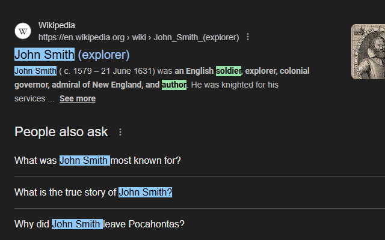

# **Web Name Highlighter**

A Chrome extension that highlights names and keywords on web pages.

---

## **Features**

* **Custom Groups**: Organize names into groups with their own settings.
* **Name Management**: Add, edit, or delete names within each group.
* **Keyword Highlighting**: Create keyword groups with individual highlight and text colors.
* **Collapsible Groups**: Collapse or expand groups to reduce scrolling.
* **Custom Name Variants**: Select from default templates or add your own, with wildcard support (e.g., `jo* smith`).
* **Full-Page Highlighting**: Highlights all occurrences on the current page.
* **Group Name on Hover**: Hovering a highlighted name shows its group name.
* **Custom Colors**: Set highlight and text colors for last name and full name matches per group.
* **CSV Import**: Import names from a CSV file with append or replace options.

## **Usage**

1. Load the extension in Chrome:

   * Open `chrome://extensions`
   * Enable **Developer Mode**
   * Click **Load unpacked** and select this folder.
2. Click the extension icon to open the popup.
3. Create name or keyword groups in the popup, then click **Save** for each section.

   * Name groups include color pickers for last and full name highlights.
   * **Import CSV** accepts `first,last` format, with **Append** or **Replace** options.
4. The active page will automatically highlight matching names and keywords with your chosen colors.

## **Privacy Policy**

**Effective Date:** August 15, 2025

Web Name Highlighter does not collect, transmit, or store any personal data on external servers.

### **Data We Access**

* **Page Content**: The extension reads the text of web pages you visit only to identify and highlight names and keywords you have configured.
* **Local Data Storage**: Names, keywords, groups, and color preferences you add are stored locally in your browser using Chrome's `chrome.storage` API.

### **Data We Do Not Collect**

* No browsing history, personal information, or unrelated data.
* No data is sent to external servers.
* No selling, renting, or sharing of user data with third parties.

### **How Data Is Used**

* All processing and highlighting occur entirely on your device.
* Your stored names, keywords, and preferences remain in your local browser storage until you remove them.

### **Contact**

If you have questions about this privacy policy, you can open an issue in the GitHub repository or [email me](mailto:me@zachstrout.com).

