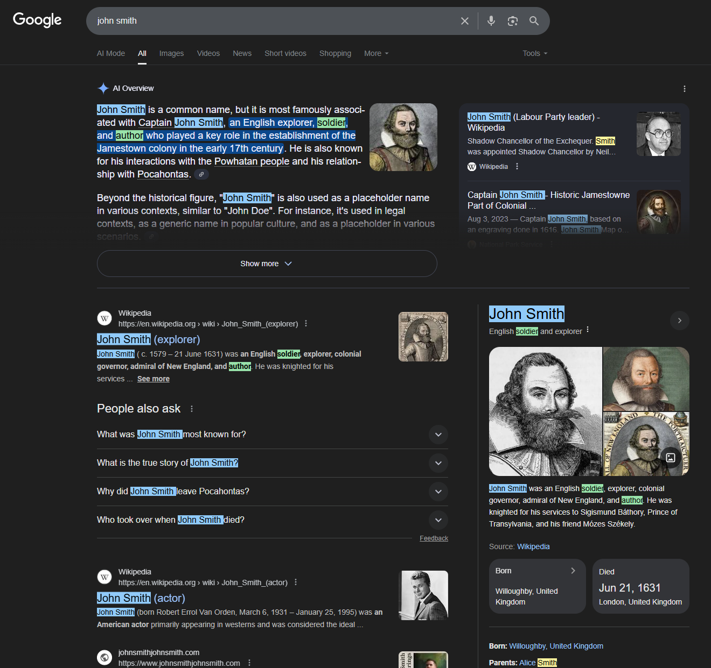

# Web Name Highlighter

Chrome extension that highlights names and keywords on web pages.

## Features
- Organize names into custom groups.
- Add, edit, or delete names within each group.
- Organize keywords into custom groups with individual highlight and text colors.
- Collapse or expand groups to reduce scrolling.
- Automatically generates name variants (e.g. `j smith`, `j. smith`, `john smith`, `smith, j`, `smith, john`).
- Highlights all occurrences on the current page.
- Hovering a highlighted name displays its group name.
- Assign custom highlight and text colors for last and full name matches per group.
- Import names into each group from a CSV file with append or replace options.

## Usage
1. Load the extension in Chrome via `chrome://extensions` → **Load unpacked** and select this folder.
2. Click the extension icon to open the popup.
3. Create name or keyword groups in the popup, then click the corresponding **Save** buttons.
   Each name group provides color pickers for last and full name highlights and an **Import CSV** control that accepts files with `first,last` columns and lets you **Append** to or **Replace** the existing names.
4. The active page will highlight matching names and keywords with their group highlight and text colors.
